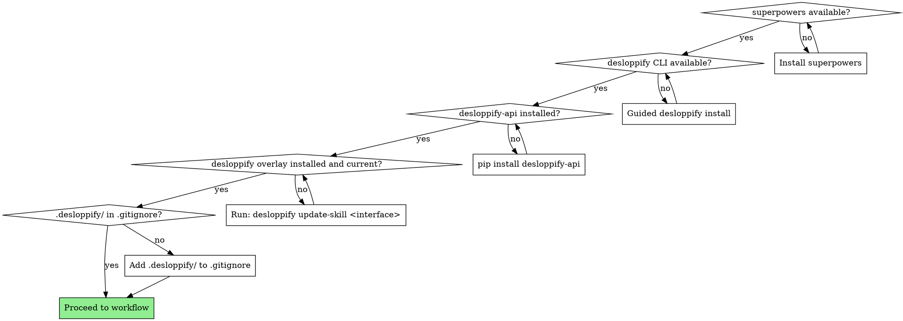
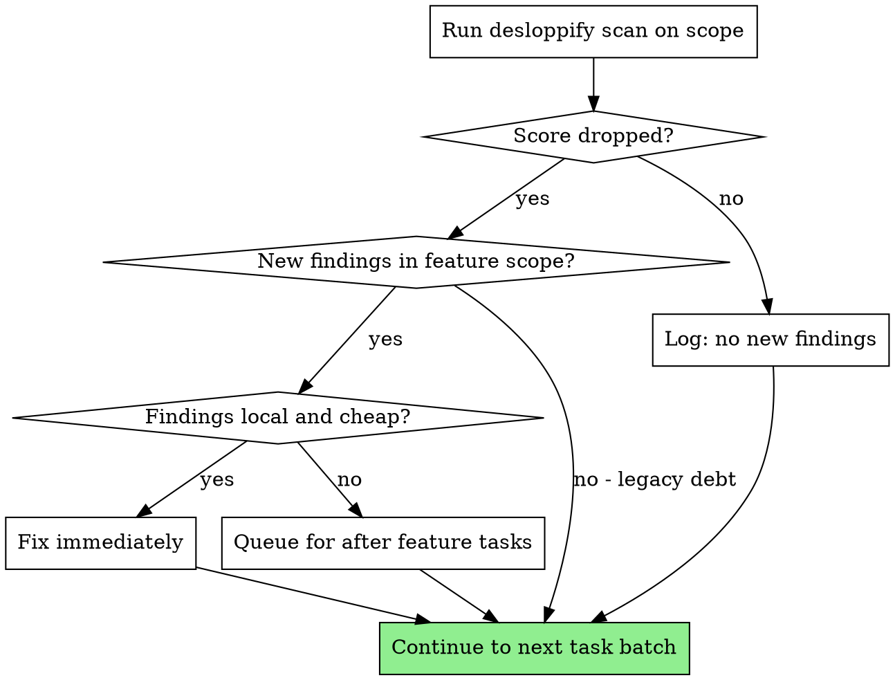

# Super Deslop

Compose upstream `superpowers` and `desloppify` into one full-agency workflow via the standalone `desloppify-api` library. This skill does not replace either tool — it orchestrates both at defined checkpoints so feature delivery and code-health improvement happen in the same pass.

## Prerequisites

Three upstream tools must be available. Do not silently fall back to partial workflows.



### Guided Install

```bash
pip install --upgrade "desloppify[full]"
pip install desloppify-api
desloppify update-skill claude    # or: opencode, cursor, codex, copilot, etc.
```

Add `.desloppify/` to `.gitignore`. Exclude obvious non-source directories.

### Baseline Scan

```bash
desloppify scan --path .
desloppify status
```

Record the baseline strict score.

## The Workflow

Five stages, executed in order. Full agency by default.

### Stage 1: Design

**REQUIRED:** Use `superpowers:brainstorming` exactly as defined.

### Stage 2: Plan

**REQUIRED:** Use `superpowers:writing-plans` exactly as defined, with one addition.

After the standard plan header, add a **Quality Intent** section:

```markdown
## Quality Intent

**Touched paths:** src/api/, src/models/user.ts, tests/api/
**Likely slop risks:** new API route may duplicate validation logic from existing routes
**Checkpoint cadence:** after every 2-3 tasks
**Scan scope:** src/api/ (narrow) or . (if cross-cutting changes detected)
**Scope rule:** fix health-lane findings only when caused by or adjacent to feature work; defer legacy debt
```

### Stage 3: Implement

**REQUIRED:** Use `superpowers:subagent-driven-development` exactly as defined.

The bridge adds desloppify checks at two levels:

#### Pre-Implementation: Reuse Check

Before writing new code for each task, check whether existing code already serves the purpose:

```python
from desloppify_api import DesloppifySession
session = DesloppifySession(path=".")
findings = session.get_findings(scope="src/api/")
```

Or via CLI:
```bash
desloppify show --file src/api/
desloppify tree src/api/
```

If existing code covers the need, reuse it. If it partially covers the need, extend rather than duplicate.

#### Per-Task: Lightweight File Checks

After each task completes (and passes spec + code-quality review), run a fast file check on the modified files:

```python
from desloppify_api import DesloppifySession
session = DesloppifySession(path=".")
result = session.check_files(["src/api/routes.py", "src/api/auth.py"])
for finding in result.findings:
    print(f"  {finding.detector}: {finding.summary}")
```

If the check surfaces findings in the files just modified:
- **Naming, complexity, duplication** — fix immediately
- **Structural issues** — note for the batch checkpoint
- **Pre-existing issues** — ignore (not caused by this task)

#### Per-Batch: Scoped Scan and Score Check

After completing a batch of 2-3 tasks:

```bash
desloppify scan --path <scope>
desloppify status
desloppify next
```



### Stage 4: Finish Gate

Before the branch is considered complete, ALL of these must be true:

- [ ] All feature-plan tasks are done
- [ ] Implementation tests pass
- [ ] `superpowers` review passes (spec compliance + code quality)
- [ ] Final `desloppify scan --path <scope>` has been run
- [ ] No new health findings introduced (or explicitly deferred with rationale)
- [ ] Strict score is equal to or better than baseline

Then use `superpowers:finishing-a-development-branch` to complete.

## Desloppify-API Reference

The `desloppify-api` package (`pip install desloppify-api`) provides structured Python access to desloppify without modifying the upstream repo.

```python
from desloppify_api import DesloppifySession

session = DesloppifySession(path=".")

# Prerequisites
prereqs = session.check_prerequisites()  # -> PrerequisiteResult

# Scanning
result = session.baseline_scan()          # full scan, records baseline
result = session.scoped_scan(["src/"])    # scan subtree, merge into state
check = session.check_files(["f.py"])     # fast check, no state merge

# Querying
scores = session.get_scores()             # -> ScoreBundle
findings = session.get_findings("src/")   # -> list[Finding]
queue = session.get_queue(count=5)        # -> list[QueueItem]

# Comparing
delta = session.score_delta()             # -> ScoreDelta vs baseline
new = session.new_findings_since_baseline()

# Acting
session.resolve("finding_id", note="removed dead code")

# Serialisation
json_dict = session.to_json(scores)       # any result -> plain dict
```

### When to Use API vs CLI

| Situation | Use |
|---|---|
| Per-task file checks (fast, no state merge) | API: `session.check_files()` |
| Score comparison against baseline | API: `session.score_delta()` |
| Structured finding data for decisions | API: `session.get_findings()` |
| Full scan with narrative output | CLI: `desloppify scan --path .` |
| Queue-driven execution loop | CLI: `desloppify next` |
| Subjective review workflow | CLI: `desloppify review --prepare` |
| Resolving findings with attestation | CLI: `desloppify plan resolve` |

## Scope Control

- **Feature lane:** tasks from the approved `superpowers` implementation plan
- **Health lane:** `desloppify` findings caused by or tightly adjacent to feature work

Fix health-lane items when local and cheap. Defer broader legacy debt. Never let `desloppify next` pull you into repo-wide cleanup during a feature branch.

## Red Flags

- Skipping the baseline scan before feature work
- Silently falling back to repo-native linters when `desloppify` is missing
- Absorbing legacy findings into the feature branch scope
- Skipping the finish gate because "tests pass"
- Running `desloppify` on the entire repo when the plan says to scope narrowly
- Writing new code without checking for existing reusable code
- Skipping per-task file checks because "the batch checkpoint will catch it"

## Upstream Preservation

This skill composes upstream tools by reference, not by copy:
- `superpowers` skills are invoked by name (`superpowers:brainstorming`, etc.)
- `desloppify` CLI is called directly for narrative-rich operations
- `desloppify-api` is called for structured programmatic access
- All three can be upgraded independently without changing this bridge
